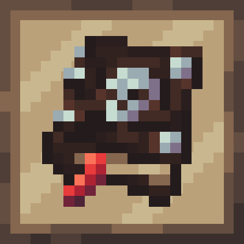

<div align="center">



# The Book of the Dead

<!-- todo: replace 494721 with your CurseForge project id -->
[][releases]
[][curseforge]
[][curseforge:files]
</div>

It is built on the [Quilt][quilt] mod loader and is available for modern
versions of [Minecraft][minecraft] Java Edition.
# Compat

### Butchering
To add butchering recipes, add entity to the butchering tag and make a recipe like example below. Up to 8 items can be added in the same recipe. chance is chance for item to actaully drop when a butchering attempt is made, values between 0 and 1, default a 1 (100%)
```
{
  "type": "book_of_the_dead:butchering",
  "entity_type": "minecraft:sheep",
  "results": [
    {
      "item": "minecraft:stick",
      "count": 1,
      "chance": 1
    },
    {
      "item": "minecraft:iron_sword",
      "count": 1,
      "nbt": {
        "Damage": 240
      },
      "chance": 1
    }
  ]
}
```
### Rituals
* For rituals the following recipe is an example, ``"ritual": "book_of_the_dead:basic"`` is most likely what you want, other types of rituals is for very specific things like lichdom or entanglement.
* All durations are in minecraft ticks, and a second is 20 ticks.
* All arrays fit as many entries as you want.
* The command requires ``execute positioned {pos} run`` to properly parse the command and ``{pos}`` is the rituals center pos. More arguments might be avalible in future updates
* All items support nbt as shown in the butchering recipe above.

This recipe below will require an emerald tablet to be on the ritual table, it only requires one stick on a pedestal, and it will create a stick, a sheep and a grass block 10 blocks above ritual center. It will also give the Speed effect to all entities nearby for 1 second.
```
{
  "type": "book_of_the_dead:ritual",
  "ritual": "book_of_the_dead:basic",
  "requireBotD": false,
  "requireEmeraldTablet": true,
  "duration": 160,

  "inputs": [
    {
      "item" : "minecraft:stick"
    }
  ],
  "outputs": [
    {
      "item" : "minecraft:stick"
    }
  ],
  "sacrifices": [],
  "summons": [
    {
      "entity": "minecraft:sheep"
    }
  ],
  "commands": [
    {
      "command": "execute positioned {pos} run setblock ~ ~10 ~ minecraft:grass_block",
      "type": "start" //When the command should execute, "start", "tick" and "end". "tick" runs every tick while "start" and "end" only runs once.
    }
  ],
  "statusEffects": [
    {
      "id" : "minecraft:speed",
      "amplifier" : 1,
      "duration": 20
    }
  ]
}

```

[curseforge]: https://curseforge.com/minecraft/mc-mods/book_of_the_dead/files
[curseforge:files]: https://curseforge.com/minecraft/mc-mods/book_of_the_dead/files
[quilt]: https://quiltmc.org/
[minecraft]: https://minecraft.net/
[releases]: https://github.com/mrsterner/TheBotD/releases
[mrsterner]: https://github.com/mrsterner
