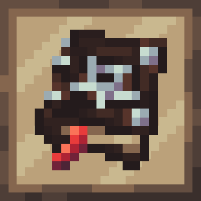

<div align="center">



# The Legemeton

<!-- todo: replace 494721 with your CurseForge project id -->
[][releases]
[][curseforge]
[][curseforge:files]
</div>


It is built on the [Quilt][quilt] mod loader and is available for modern
versions of [Minecraft][minecraft] Java Edition.

# Compat
To add butchering recipes, add entity to the butchering tag and make a recipe like example below. Up to 8 items can be added in the same recipe. chance is chance for item to actaully drop when a butchering attempt is made, values between 0 and 1, default a 1 (100%)
```
{
  "type": "legemeton:butchering",
  "entity_type": "minecraft:sheep",
  "results": [
    {
      "item": "minecraft:stick",
      "count": 1,
      "chance": 1
    },
    {
      "item": "minecraft:iron_sword",
      "count": 1,
      "nbt": {
        "Damage": 240
      },
      "chance": 1
    }
  ]
}

```


## Licence
* Code
    - (c) 2022  [MrSterner]
    - [](https://opensource.org/licenses/MIT)
* Models and Textures
    - (c) 2022  [MrSterner]
    - [](https://opensource.org/licenses/ARR)


[curseforge]: https://curseforge.com/minecraft/mc-mods/legemeton/files
[curseforge:files]: https://curseforge.com/minecraft/mc-mods/legemeton/files
[quilt]: https://quiltmc.org/
[minecraft]: https://minecraft.net/
[releases]: https://github.com/mrsterner/TheLegemeton/releases
[mrsterner]: https://github.com/mrsterner
